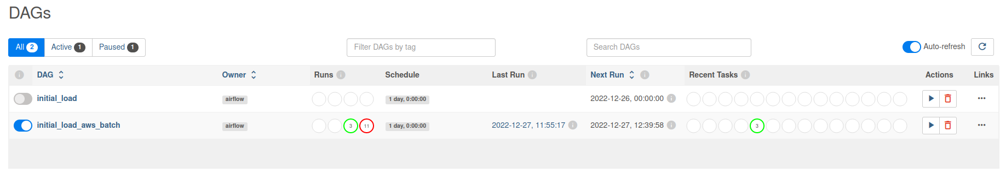

# AirPollution


Source: wikipedia

## Project description
Big Data project with ELT (Extract, Load, Transform) to process data from OpenWeather regarding air pollution in Polish voivodeship cities.
Historical data is extracted by using OpenWeather API and stored on S3 bucket. Next, data is validated and transformed by Apache Spark (thanks to pyspark library) to parquet files stored on S3. Data can by viewed and analysed on Athena.

## Technologies used
1. Apache Spark
2. AWS services (Cloudformation, Athena, S3, Glue, ECR, Batch)
3. Apache Airflow
4. Python
5. SQL
6. Docker

### Prerequisites
1. Access to AWS with credentials
2. Python 3.7 environment configured
3. Basic knowledge about AWS services (Cloudformation, Athena, S3, Glue, ECR, Batch)
4. Basic knowledge about Apache Airflow
5. Ubuntu system (the best 20.04.05)

## Installation
1. Paste your AWS credentials to credentials file stored on .aws directory your HOME location (example: /home/.aws/credentials). Your file should look like this:

```sh
[default]
aws_access_key_id=bb***************gg
aws_secret_access_key=Q**************E
aws_session_token=E**************************************R
```
2. Clone the repo
```sh
git clone https://github.com/BigAdriano/AirPollution.git
```
3. On AWS go to Cloudformation service

4. Use template "ReadyTemplate" from Cloudformation directory to create infrastructure on cloud

5. In main directory write in shell and pass Enter:
```sh
python3 set_env.py
```
6. Go to Docker directory, by writing it in shell:
```sh
cd Docker
```

7. In shell write and pass Enter:
```sh
docker compose up airflow-init
```
8. Then write and pass Enter:
```sh
docker-compose up
```
9. Go to awsbatch directory:
```sh
cd ..
cd AWSBatch
```

9. Check your AWS Account ID and write it instead of <Account_ID>
```sh
export ACCOUNT_ID=<Account_ID>
```
10. Copy, paste and pass Enter:
```sh
aws ecr get-login-password --region us-east-1 | docker login --username AWS --password-stdin ${ACCOUNT_ID}.dkr.ecr.us-east-1.amazonaws.com
```
```sh
docker build -t  ${ACCOUNT_ID}.dkr.ecr.us-east-1.amazonaws.com/adrianogloza .
```
```sh
docker push ${ACCOUNT_ID}.dkr.ecr.us-east-1.amazonaws.com/adrianogloza
```

## Running on Airflow:
1. Go to Airflow UI on localhost:8080 in your browser
2. Run DAG "initial_load_aws_batch":
   
3. After some time your task should be completed, which means that data right now is stored in S3 bucket and is accessible from Athena